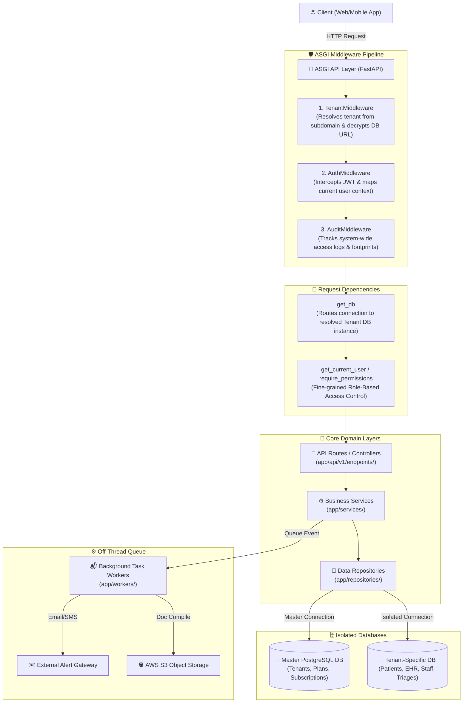

# Project Architecture Blueprint & Directory Guide

This document provides a comprehensive architectural blueprint and detailed folder structure guide for the Carepoint HMS (Hospital Management System) multi-tenant SaaS backend. It is designed to serve as a clean, structured reference template for setting up a new scalability-first project using the same premium design patterns.

---

## 🏛️ Architectural Overview

The backend uses a highly decoupled, modular **Service-Repository** pattern wrapped in a **split-database Multi-Tenant SaaS** framework. The architecture is divided into clear operational layers to enforce separation of concerns, visualised below:



---

## 📂 Detailed Folder Structure Reference

Below is the layout of the project workspace. You can drop this directly into your new project as a structural foundation.

```text
├── .dockerignore               # Optimises Docker image compilation
├── .env.example                # Templates of global environment configurations
├── Dockerfile                  # Multi-stage production container setup
├── docker-compose.yml          # Local container environment orchestration (DBs, Cache)
├── pyproject.toml              # Modern Python dependency specifications (pytest, black)
├── requirements.txt            # Traditional pip package lock list
│
├── scripts/                    # 🛠️ Operational & Migration Scripting
│   ├── DEPLOYMENT.md           # Instructions on system provisioning
│   ├── seed_comprehensive.py   # Seeding parameters and default security roles
│   └── migrate_patient_clinical_records.py  # Automated schema synchronization utility
│
└── app/                        # 🚀 Core Application Package
    ├── main.py                 # Application boots, mounts pipelines & maps CORS
    ├── db_sync.py              # 🧠 Automatically compiles/applies database schema sync
    ├── init_db.py              # Seeds default system configurations and initial admin
    ├── scheduler.py            # Crontab engine dispatching daily checks & reminders
    │
    ├── api/                    # 🔌 Routing & Controller Endpoints
    │   └── v1/
    │       ├── api.py          # Central endpoint router aggregation
    │       └── endpoints/      # Module routers (e.g., patient_routes.py, triage_routes.py)
    │
    ├── core/                   # 🛡️ Global Core Infrastructure
    │   ├── config.py           # Strictly typed global environment setups (Pydantic Settings)
    │   ├── constants.py        # Centralized system enums, flags, and constants
    │   ├── cryptography.py     # Reversible Fernet encryption to secure tenant DB credentials
    │   ├── database.py         # SQLAlchemy engine manager, connection pools & thread contexts
    │   ├── enums.py            # Global domain status markers, severity types, and enums
    │   ├── exceptions.py       # Standardized custom HTTP API exceptions (e.g., NotFoundError)
    │   ├── logger.py           # Centralized application logging configurations
    │   └── security.py         # JWT tokens generation, hashing, and signature validation
    │
    ├── middleware/             # 🚧 ASGI Pipeline Request Processors
    │   ├── tenant_middleware.py  # Dynamically routes queries by mapping & decrypting tenant DBs
    │   ├── auth_middleware.py  # GRPC-like parsing of request scopes and bearer context
    │   ├── audit_middleware.py # Injects transactional audit tracking markers
    │   └── rate_limit_middleware.py # Shields services against denial-of-service attempts
    │
    ├── dependencies/           # 🔌 FastAPI Injected Guard dependencies
    │   ├── auth.py             # Validates current active session, locks, and expired tokens
    │   ├── role.py             # Guards pathways with fine-grained permission assertions
    │   └── subscription.py     # Halts API actions if a tenant's subscription expires
    │
    ├── models/                 # 🗄️ Database Schema & Object-Relational Mappers (ORM)
    │   ├── base.py             # Splits declarative base into MasterBase and TenantBase metadata
    │   └── all_models.py       # Single-point of truth mapping entities to database tables
    │
    ├── repositories/           # 💾 Data Access Repository Layer (Decoupled CRUD queries)
    │   ├── base_repository.py  # Generic reusable operations (save, retrieve, soft-delete)
    │   └── patient_repository.py # Domain-specific transactional database query logic
    │
    ├── schemas/                # 📝 Serialization, Marshalling, and Request Validation
    │   ├── base_schemas.py     # Central validation schemas with custom date/time formats
    │   └── patient_schemas.py  # Pydantic V2 inputs/outputs matching endpoints
    │
    ├── services/               # ⚙️ Business Domain logic Orchestrator
    │   ├── medical_history_service.py # Aggregates historical patient files from 12+ tables
    │   └── patient_service.py  # Runs patient lifecycle routines & initiates change logs
    │
    ├── workers/                # 📬 Background Worker Task Pipeline
    │   ├── notification_worker.py # Dispatches email, SMS, and in-app alerts asynchronously
    │   └── report_worker.py    # Assembled documents & uploads reports to S3 in the background
    │
    └── tests/                  # 🧪 Suite of Unit & Integration Tests
        ├── conftest.py         # Test DB lifecycle management & schema patching
        ├── unit/               # Domain logic unit tests (with MagicMock DB isolations)
        └── integration/        # Client endpoint checks running against a temporary test DB
```

---

## 💎 Core Design Patterns Explained

If you are setting up a new project based on this architecture, focus on mastering these four essential core design patterns:

### 1. Dynamic Tenant Database Isolation
* **Pattern**: Dynamic Multi-Tenancy (Schema/Physical Database-per-Tenant).
* **How it works**:
  1. The master database stores all tenants, with their database connection strings encrypted using a central key (`DATABASE_ENCRYPTION_KEY`).
  2. The `TenantMiddleware` intercepts incoming requests, reads the hostname or custom header (e.g. `tenant-x.carepoint.com`), queries the master database, decrypts the connection string, and caches the database engine.
  3. The `get_db` dependency retrieves this engine context, routing the request's execution to that isolated tenant database instance without cross-tenant pollution.

### 2. Service-Repository Pattern
* **Pattern**: Pure Separation of Persistence and Business Logic.
* **How it works**:
  * **Repositories** (`app/repositories/`): The only layer permitted to construct SQLAlchemy database queries. They return SQLAlchemy models and are completely unaware of HTTP requests or business policies.
  * **Services** (`app/services/`): The core domain orchestration engine. They receive Pydantic schemas, coordinate data operations using repositories, validate business policies (e.g. duplicate checking), execute transactions, and initiate background workers.
  * **Endpoints** (`app/api/v1/endpoints/`): Extremely thin controllers. They exist only to declare routes, dependencies, and serialize output Pydantic schemas.

### 3. ASGI Middleware Pipeline
* **Pattern**: Clean, layered Request Interception.
* **How it works**:
  Instead of embedding authentication, tenant lookup, and rate-limiting within routes, they are processed globally at the ASGI gateway layer. By the time a request reaches your endpoint logic, the tenant is resolved, the user is authenticated, the role is validated, and the audit log is already initialized.

### 4. Dynamic, Automatic Database Synchronization
* **Pattern**: Declarative, Idempotent migrations.
* **How it works**:
  The `app/db_sync.py` module compares declarative models (`TenantBase.metadata`) with the physical tables of the database at startup or via a script. It dynamically executes compiler-safe `ALTER TABLE ADD COLUMN IF NOT EXISTS` commands. This allows developers to add columns to models and immediately synchronize them across hundreds of customer tenant databases with a single lightweight script, bypassing complex Alembic configuration for multi-tenant dynamic schemas.

---

> [!TIP]
> **Recommended Startup Flow for your New Project:**
> 1. Set up `requirements.txt` with FastAPI, SQLAlchemy 2.0, Pydantic V2, and Psycopg2.
> 2. Create the file structure outlined in the layout above.
> 3. Implement `app/core/config.py` and `app/core/database.py`.
> 4. Create the base DB models in `app/models/base.py` to support separated Master/Tenant routing.
> 5. Create `app/db_sync.py` to handle automatic table and column generation.
> 6. Start building your first domain module under `schemas/`, `repositories/`, `services/`, and `endpoints/`.
